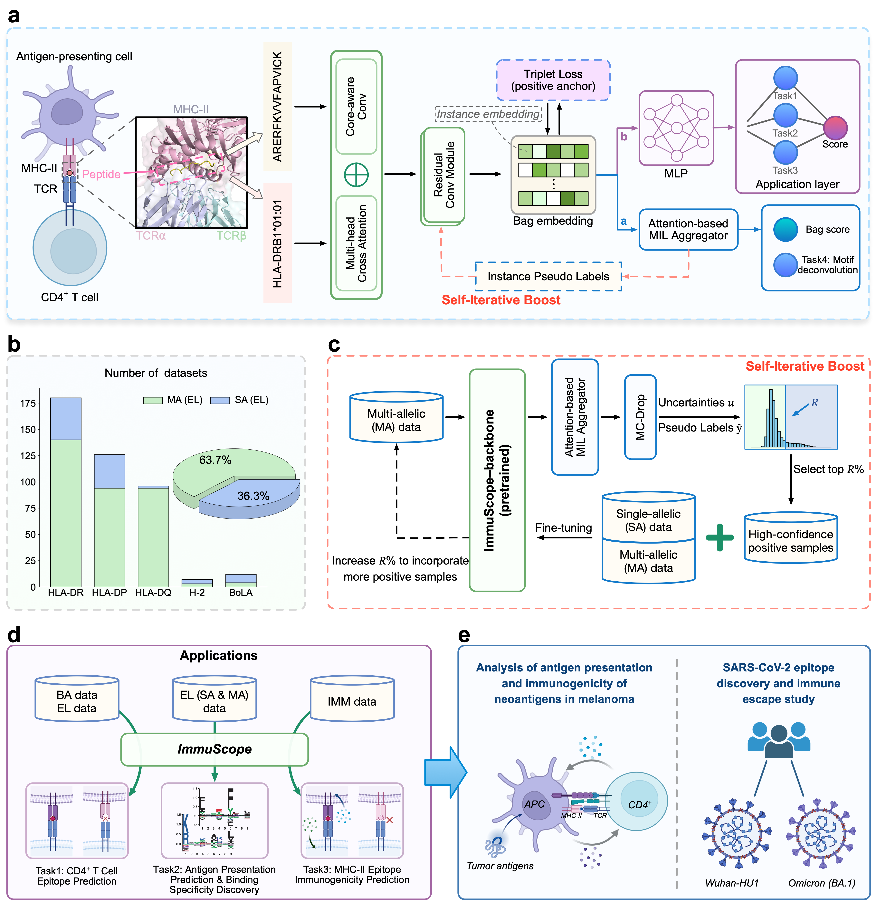

## ImmuScope: Self-iterative multiple-instance learning enables the prediction of CD4<sup>+</sup> T cell immunogenic epitopes

This repository contains the source code for the paper **[Self-iterative multiple-instance learning enables the prediction of CD4<sup>+</sup> T cell immunogenic epitopes](https://www.nature.com/articles/s42256-025-01073-z)**.

- [Overview](#overview)
- [Installation](#installation)
- [Data and model weights](#data-and-model-weights)
- [Repo contents](#repo-contents)
- [Usage](#usage)
- [Citation](#citation)
- [Contact](#contact)

## Overview
Accurately predicting the antigen presentation to CD4<sup>+</sup> T cells and subsequent induction of immune response is fundamentally important for vaccine development, autoimmune disease treatments, and cancer neoepitope identification. In immunopeptidomics, single-allelic data are highly specific but limited in allele scope, while multi-allelic data contain broader coverage at the cost of weakly labeling. Existing computational approaches either overlook the massive multi-allelic data or introduce label ambiguity due to inadequate modeling strategies. Here, we introduce **ImmuScope**, a **weakly supervised deep-learning framework** integrating precise MHC-II antigen presentation, CD4<sup>+</sup> T cell epitopes, and immunogenicity predictions. ImmuScope leverages self-iterative multiple-instance learning with positive-anchor triplet loss to explore peptide-MHC-II (pMHC-II) binding from weakly labeled multi-allelic data and single-allelic data, comprising over 600,000 ligands across 142 alleles. Moreover, ImmuScope can also interpret the MHC-II binding specificity and motif deconvolution of immunopeptidomics data. We successfully applied ImmuScope to discover melanoma neoantigens, revealing variations in pMHC-II binding and immunogenicity upon epitope mutations. We further employed ImmuScope to assess the effects of SARS-CoV-2 epitope mutations on immune escape, with its predictions aligned well with experimentally determined immune escape dynamics. Overall, ImmuScope provides a comprehensive solution for CD4<sup>+</sup> T cell antigen recognition and immunogenicity assessment, with broad potential for advancing vaccine design and personalized immunotherapy.



## Installation

1. Clone the repository.

   ```bash
   git clone https://github.com/shenlongchen/ImmuScope.git
   ```
2. Create a virtual environment by conda.

   ```bash
   conda create -n ImmuScope_env python=3.9.19
   conda activate ImmuScope_env
   ```
3. Download PyTorch>=1.12.1, which is compatible with your CUDA version and other Python packages.
   
   ```bash
   conda install pytorch==1.12.1 torchvision==0.13.1 torchaudio==0.12.1 cudatoolkit=11.6 -c pytorch -c conda-forge
   ```
4. Install other dependencies.
   
   ```bash
   pip install -r requirements.txt
   ```

## Data and model weights

The following data and model weights are available at [Zenodo](https://doi.org/10.5281/zenodo.14184201).

   ```bash
   tar -xvzf ImmuScope-data.tar.gz
   tar -xvzf ImmuScope-weights.tar.gz
   ```

In **`ImmuScope-data.tar.gz`** File:
- `data/raw`: Raw data related to antigen presentation and CD4<sup>+</sup> T cell epitopes: binding affinity data, EL
  data, CD4<sup>+</sup> T cell epitope benchmarking test data, MHC-II allele list, supported MHC-II pseudo sequences.
- `data/el_datasets`: single- and multi- allelic antigen presentation training data applied
  to ImmuScope input.
- `data/cd4_datasets`: binding affinity training data and CD4<sup>+</sup> T cell epitope benchmarking test data applied to
  ImmuScope input.
- `data/im_datasets`: Immunogenicity training and testing data applied to ImmuScope input and raw data.

In **`ImmuScope-weights.tar.gz`** File:
- `weights/EL`: model weights for predicting antigen presentation & binding specificity discovery & multi-allelic data
  binding motif deconvolution.
- `weights/CD4`: model weights for predicting CD4<sup>+</sup> T cell epitope.
- `weights/IM`: model weights for predicting MHC-II epitope immunogenicity.

## Repo contents
```shell
ImmuScope/
│── configs/       # Configuration files (e.g., model parameters, training settings)
│── data/          # Dataset storage and preprocessing scripts (Extract ImmuScope-data.tar.gz File)
│── ImmuScope/     # Core project code and implementation
│── results/       # Experiment outputs (e.g. ImmuScope-EL, ImmuScope-CD4 and ImmuScope-IM) and logs
│── weights/       # Trained model weights and checkpoints (Extract ImmuScope-weights.tar.gz File)
│── main_antigen_presentation_5cv.py   # 5-fold cross validation for antigen presentation prediction
│── main_antigen_presentation_train.py # Train antigen presentation model with eluted ligand data
│── main_cd4_epitope_train.py          # Train CD4+ T cell epitope prediction model
│── main_cd4_epitope_test.py           # Test CD4+ T cell epitope prediction model
│── main_immunogenicity_train.py       # Train immunogenicity prediction model
│── main_immunogenicity_test.py        # Test immunogenicity prediction model
│── README.md        # Project documentation
│── requirements.txt # List of dependencies
```

## Usage

### 1. Antigen presentation prediction

- 5-fold cross validation for antigen presentation prediction.

  ```bash
  python main_antigen_presentation_5cv.py \
      --data-cnf configs/data.yaml \
      --model-cnf configs/ImmuScope-EL.yaml
  ```
- Train antigen presentation prediction model using single- and multi-allelic eluted ligand data.

  ```bash
  python main_antigen_presentation_train.py \
      --data-cnf configs/data.yaml \
      --model-cnf configs/ImmuScope-EL.yaml
  ```

### 2. CD4<sup>+</sup> T cell epitope prediction

- Train CD4<sup>+</sup> T cell epitope prediction model based on antigen presentation prediction model.

  ```bash
  python main_cd4_epitope_train.py \
      --data-cnf configs/data.yaml \
      --model-cnf configs/ImmuScope.yaml
  ```

- Test CD4<sup>+</sup> T cell epitope prediction model on benchmarking test data (trained model weights are available in **`weights/CD4`**).

  ```bash
  python main_cd4_epitope_test.py \
      --data-cnf configs/data.yaml \
      --model-cnf configs/ImmuScope.yaml                                 
  ```

### 3. MHC-II epitope immunogenicity prediction

- Train immunogenicity prediction model with immunogenicity data.

  ```bash
  python main_immunogenicity_train.py \
      --data-cnf configs/data.yaml \
      --model-cnf configs/ImmuScope-IM.yaml
  ```
- Test immunogenicity prediction model on immunogenicity data (trained model weights are available in **`weights/IM`**).

  ```bash
  python main_immunogenicity_test.py \
      --data-cnf configs/data.yaml \
      --model-cnf configs/ImmuScope-IM.yaml
  ```

## Citation
```tex
@article{shen2025self,
  title={Self-iterative multiple-instance learning enables the prediction of CD4+ T cell immunogenic epitopes},
  author={Shen, Long-Chen and Zhang, Yumeng and Wang, Zhikang and Littler, Dene R and Liu, Yan and Tang, Jinhui and Rossjohn, Jamie and Yu, Dong-Jun and Song, Jiangning},
  journal={Nature Machine Intelligence},
  pages={1--16},
  year={2025},
  publisher={Nature Publishing Group UK London}
}
```

## Contact

If you have any questions, please contact us
at [shenlc1995@njust.edu.cn](mailto:shenlc1995@njust.edu.cn), [njyudj@njust.edu.cn](mailto:njyudj@njust.edu.cn)
or [jiangning.song@monash.edu](mailto:jiangning.song@monash.edu).
